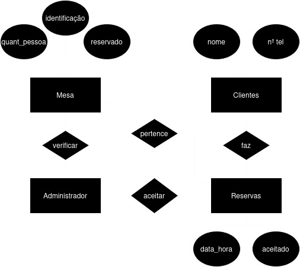

# Restaurante Bifes - Sistema de Reservas

Este projeto implementa um sistema de reservas para o restaurante Bifes usando MongoDB como base de dados. O sistema permite que os clientes reservem mesas e que os administradores gerenciem as reservas.

## Estrutura da Base de Dados

### Coleção `mesas`
Armazena informações sobre as mesas do restaurante.

- **_id**: Identificador único da mesa (ObjectId).
- **identificacao**: Identificação numérica da mesa (NumberInt).
- **quantidade_pessoas**: Número máximo de pessoas que a mesa pode acomodar (NumberInt).
- **reservado**: Indica se a mesa está reservada (Boolean).

### Coleção `clientes`
Armazena informações sobre os clientes.

- **_id**: Identificador único do cliente (ObjectId).
- **nome**: Nome do cliente (String).
- **telemovel**: Número de telemóvel do cliente (String).

### Coleção `reservas`
Armazena informações sobre as reservas realizadas.

- **_id**: Identificador único da reserva (ObjectId).
- **cliente_id**: Identificador do cliente que fez a reserva (ObjectId).
- **mesa_id**: Identificador da mesa reservada (ObjectId).
- **data_hora**: Data e hora da reserva (ISODate).
- **aceitado**: Indica se a reserva foi aceita pelo administrador (Boolean).

## Funcionalidades

- **Clientes**: Podem fazer reservas fornecendo nome, quantidade de pessoas, data e hora.
- **Administradores**: Podem visualizar reservas pendentes e decidir se aceitam ou recusam, notificando os clientes através do número de telemóvel.

## Modelo ER
