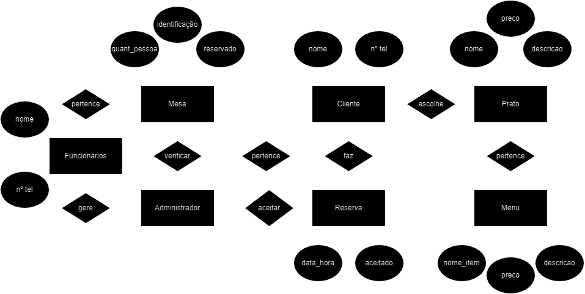

# Restaurante Bifes - Sistema de Reservas

Este projeto implementa um sistema de reservas para o restaurante Bifes usando MongoDB como base de dados. O sistema permite que os clientes reservem mesas, escolham pratos e que os administradores gerenciem as reservas e as mesas.

## Estrutura da Base de Dados

### Coleção `mesas`
Armazena informações sobre as mesas do restaurante.

- **_id**: Identificador único da mesa (ObjectId).
- **identificacao**: Identificação numérica da mesa (NumberInt).
- **quantidade_pessoas**: Número máximo de pessoas que a mesa pode acomodar (NumberInt).
- **reservado**: Indica se a mesa está reservada (Boolean).
- **funcionario_id**: Identificador do funcionário responsável pela mesa (ObjectId).

### Coleção `clientes`
Armazena informações sobre os clientes.

- **_id**: Identificador único do cliente (ObjectId).
- **nome**: Nome do cliente (String).
- **telemovel**: Número de telemóvel do cliente (String).

### Coleção `reservas`
Armazena informações sobre as reservas realizadas.

- **_id**: Identificador único da reserva (ObjectId).
- **cliente_id**: Identificador do cliente que fez a reserva (ObjectId).
- **mesa_id**: Identificador da mesa reservada (ObjectId).
- **data_hora**: Data e hora da reserva (ISODate).
- **aceitado**: Indica se a reserva foi aceite pelo administrador (Boolean).

### Coleção `menus`
Armazena informações sobre os menus do restaurante.

- **_id**: Identificador único do menu (ObjectId).
- **nome_item**: Nome do item do menu (String).
- **descricao**: Descrição do item do menu (String).
- **preco**: Preço do item do menu (NumberDecimal).

### Coleção `pratos`
Armazena informações sobre os pratos, que são parte de um menu.

- **_id**: Identificador único do prato (ObjectId).
- **menu_id**: Identificador do menu ao qual o prato pertence (ObjectId).
- **nome_prato**: Nome do prato (String).
- **descricao**: Descrição do prato (String).
- **preco**: Preço do prato (NumberDecimal).

### Coleção `escolhas`
Armazena informações sobre as escolhas de pratos feitas pelos clientes para cada reserva.

- **_id**: Identificador único da escolha (ObjectId).
- **reserva_id**: Identificador da reserva associada (ObjectId).
- **prato_id**: Identificador do prato escolhido (ObjectId).
- **quantidade**: Quantidade do prato escolhido (NumberInt).

### Coleção `funcionarios`
Armazena informações sobre os funcionários que gerenciam as mesas.

- **_id**: Identificador único do funcionário (ObjectId).
- **nome**: Nome do funcionário (String).
- **cargo**: Cargo do funcionário (String).
- **telemovel**: Número de telemóvel do funcionário (String).

## Funcionalidades

- **Clientes**: Podem fazer reservas fornecendo nome, quantidade de pessoas, data e hora, além de escolher pratos do menu.
- **Administradores**: Podem visualizar reservas pendentes e decidir se aceitam ou recusam, notificando os clientes através do número de telemóvel.
- **Funcionários**: Gerenciam as mesas atribuídas a eles.

## Modelo ER

